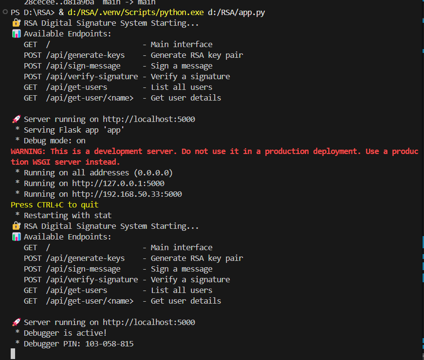

# 🔐 RSA Digital Signature System

A comprehensive web-based demonstration of RSA Digital Signature implementation for secure message authentication and verification. This project implements RSA cryptography from scratch without external crypto libraries, providing educational insight into the mathematical foundations of digital signatures.

## 🎯 Overview

This system demonstrates how RSA digital signatures work in practice, allowing users to:

- Generate RSA key pairs with custom key sizes
- Sign messages using private keys
- Verify signatures using public keys
- Understand the complete verification process with detailed logs

## ✨ Features

- **Manual RSA Implementation**: Built from scratch using pure mathematical operations
- **Key Generation**: Generate RSA key pairs with configurable sizes (educational and production modes)
- **Message Signing**: Create digital signatures using SHA-256 hashing and RSA encryption
- **Signature Verification**: Verify message authenticity and integrity
- **Interactive Web Interface**: User-friendly frontend with real-time feedback
- **Educational Insights**: Detailed process explanations and security guarantees
- **Multi-user Support**: Handle multiple users with separate key pairs

## 🏗️ Architecture

```
RSA Digital Signature System/
├── app.py                 # Flask backend with RSA implementation
├── templates/
│   └── index.html        # Frontend interface
├── static/
│   ├── style.css         # Styling
│   └── script.js         # Frontend logic
├── requirements.txt      # Python dependencies
├── screenshots/          # Project screenshots
└── README.md            # This file
```

## 🔧 Technology Stack

- **Backend**: Python 3.8+, Flask, Flask-CORS
- **Frontend**: HTML5, CSS3, JavaScript (ES6+)
- **Cryptography**: Manual RSA implementation
- **Styling**: Modern CSS with gradient backgrounds and responsive design

## 🚀 Quick Start

### Prerequisites

Make sure you have Python 3.8+ installed on your system.

```bash
python --version
# or
python3 --version
```

### Installation

1. **Clone the repository**

   ```bash
   git clone https://github.com/priyankapinky2004/RSA-Digital-Signature-System-Interactive-Demo.git
   cd rsa-digital-signature-system
   ```

2. **Create a virtual environment** (recommended)

   ```bash
   # Windows
   python -m venv venv
   venv\Scripts\activate

   # macOS/Linux
   python3 -m venv venv
   source venv/bin/activate
   ```

3. **Install dependencies**

   ```bash
   pip install -r requirements.txt
   ```

4. **Run the application**

   ```bash
   python app.py
   # or
   python3 app.py
   ```

5. **Access the application**

   Open your web browser and navigate to:

   ```
   http://localhost:5000
   ```



## 🎮 Usage Guide

### 1. Key Generation


- Enter a username (e.g., "Alice")
- Select key size:
  - **10 bits (Demo)**: For educational purposes and quick testing
  - **512 bits**: Small production keys
  - **1024 bits**: Standard security
  - **2048 bits**: High security (recommended)
- Click "Generate RSA Keys"

### 2. Message Signing


- Select the signer from the dropdown
- Enter your message in the text area
- Click "Sign Message"
- View the generated signature and message hash

### 3. Signature Verification


- Select the signer (public key owner)
- Enter the original message
- Paste the digital signature
- Click "Verify Signature"
- Check the verification result and detailed process

## 🔒 Security Features

The system implements the following security guarantees:

- **Authenticity**: Confirms the message was signed by the claimed sender
- **Integrity**: Detects any tampering with the original message
- **Non-repudiation**: Signer cannot deny signing the message


## 🧮 Mathematical Implementation

### RSA Key Generation

1. Generate two random prime numbers (p, q)
2. Compute n = p × q
3. Calculate φ(n) = (p-1) × (q-1)
4. Choose e such that gcd(e, φ(n)) = 1
5. Compute d = e⁻¹ mod φ(n)

### Digital Signature Process

1. **Signing**: signature = (hash(message))^d mod n
2. **Verification**: hash = signature^e mod n
3. **Compare**: computed_hash == received_hash

## 📡 API Endpoints

| Method | Endpoint                | Description               |
| ------ | ----------------------- | ------------------------- |
| GET    | `/`                     | Serve main interface      |
| POST   | `/api/generate-keys`    | Generate RSA key pair     |
| POST   | `/api/sign-message`     | Sign a message            |
| POST   | `/api/verify-signature` | Verify a signature        |
| GET    | `/api/get-users`        | Get all users             |
| GET    | `/api/get-user/<name>`  | Get specific user details |

### Example API Usage

```bash
# Generate keys
curl -X POST http://localhost:5000/api/generate-keys \
  -H "Content-Type: application/json" \
  -d '{"username": "Alice", "key_size": 1024}'

# Sign message
curl -X POST http://localhost:5000/api/sign-message \
  -H "Content-Type: application/json" \
  -d '{"signer": "Alice", "message": "Hello, World!"}'

# Verify signature
curl -X POST http://localhost:5000/api/verify-signature \
  -H "Content-Type: application/json" \
  -d '{"signer": "Alice", "message": "Hello, World!", "signature": "123456"}'
```

## 🎯 Demo Scenarios

### Scenario 1: Successful Verification

1. Alice generates keys
2. Alice signs message "Hello, this is a secure message!"
3. Bob verifies using Alice's public key
4. ✅ Verification succeeds

### Scenario 2: Tampered Message Detection

1. Alice generates keys and signs a message
2. Message is modified during transmission
3. Bob attempts verification with original signature
4. ❌ Verification fails - tampering detected

🌐 **Live Demo:** [https://deluxe-daffodil-226fdd.netlify.app](https://deluxe-daffodil-226fdd.netlify.app)

## 🔧 Development

### Project Structure Details

```
app.py                 # Main Flask application
├── RSADigitalSignature class
├── Prime generation utilities
├── Modular arithmetic functions
├── REST API endpoints
└── Error handling

templates/index.html   # Single-page application
├── Key generation section
├── Message signing interface
├── Signature verification panel
└── Educational information

static/
├── style.css         # Responsive design, animations
└── script.js         # API calls, DOM manipulation
```

### Running in Development Mode

```bash
# Enable debug mode
export FLASK_ENV=development
export FLASK_DEBUG=1
python app.py

# Or set in code (already configured)
app.run(debug=True, host='0.0.0.0', port=5000)
```

### Adding New Features

1. **Custom Hash Functions**: Modify the `hash_message()` method
2. **Key Export/Import**: Add serialization functions
3. **Batch Operations**: Implement bulk signing/verification
4. **Advanced UI**: Add progress bars, animations

## ⚠️ Security Considerations

### Educational vs Production Use

**⚠️ This implementation is for educational purposes**

- Small key sizes (10-bit) are intentionally weak for demonstration
- Production systems should use minimum 2048-bit keys
- Consider using established libraries (cryptography, PyCrypto) for production
- Implement proper key storage and management

### Best Practices Implemented

- ✅ Secure random number generation
- ✅ SHA-256 message hashing
- ✅ Proper modular arithmetic
- ✅ Input validation and sanitization
- ✅ Error handling and user feedback

## 🐛 Troubleshooting

### Common Issues

1. **Port Already in Use**

   ```bash
   # Kill process using port 5000
   lsof -ti:5000 | xargs kill -9
   # Or change port in app.py
   app.run(port=5001)
   ```

2. **Module Import Errors**

   ```bash
   # Reinstall dependencies
   pip install --force-reinstall -r requirements.txt
   ```

3. **Key Generation Slow**

   - Use smaller key sizes for testing
   - Larger keys (2048-bit) may take several seconds

4. **Browser Compatibility**
   - Use modern browsers (Chrome 80+, Firefox 75+, Safari 13+)
   - Enable JavaScript

### Debug Mode

Enable verbose logging by setting:

```python
app.config['DEBUG'] = True
```

## 📝 Testing

### Manual Testing Checklist

- [ ] Generate keys for multiple users
- [ ] Sign messages with different content
- [ ] Verify valid signatures
- [ ] Test with tampered messages
- [ ] Test with wrong signer selection
- [ ] Test with invalid signatures
- [ ] Test different key sizes
- [ ] Test special characters in messages

### Automated Testing

```bash
# Add to future development
python -m pytest tests/
```

## 🤝 Contributing

1. Fork the repository
2. Create a feature branch (`git checkout -b feature/amazing-feature`)
3. Commit your changes (`git commit -m 'Add amazing feature'`)
4. Push to the branch (`git push origin feature/amazing-feature`)
5. Open a Pull Request

### Development Guidelines

- Follow PEP 8 style guide
- Add comments for complex mathematical operations
- Update README for new features
- Test thoroughly with different scenarios

## 📄 License

This project is licensed under the MIT License - see the [LICENSE](LICENSE) file for details.

## 🙏 Acknowledgments

- RSA algorithm by Rivest, Shamir, and Adleman
- Mathematical foundations from number theory
- Flask web framework community
- Educational cryptography resources

## 📞 Support

If you encounter any issues or have questions:

1. Check the [Troubleshooting](#-troubleshooting) section
2. Review [Issues](https://github.com/yourusername/rsa-digital-signature-system/issues)
3. Create a new issue with detailed description

## 🎓 Educational Resources

- [RSA Algorithm Explained](<https://en.wikipedia.org/wiki/RSA_(cryptosystem)>)
- [Digital Signatures](https://en.wikipedia.org/wiki/Digital_signature)
- [Modular Arithmetic](https://en.wikipedia.org/wiki/Modular_arithmetic)
- [Prime Number Generation](https://en.wikipedia.org/wiki/Prime_number)

---

**⭐ If you found this project helpful, please give it a star!**
